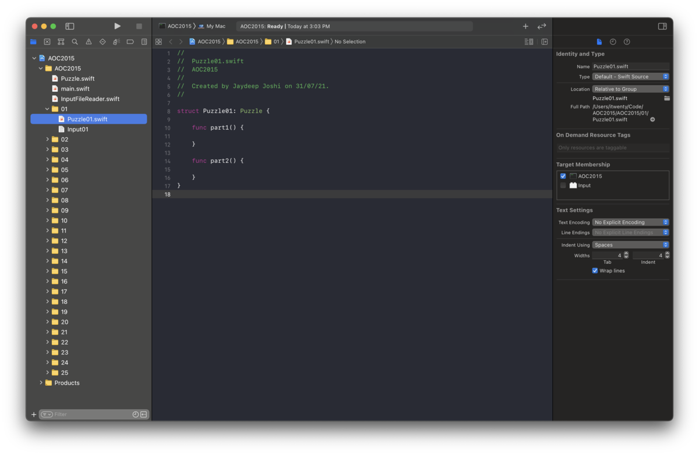

## Xcode project xctemplate for Advent of Code

This repo contains an xctemplate which is shown while creating a new project in Xcode. It will be shown under `macOS > Personal` category. The xctemplate automatically creates common Swift source and input files needed for [Advent of Code](https://adventofcode.com/). After creation, the project looks like this :

### How to install

Clone this repo in `~/Library/Developer/Xcode/Templates/Project Templates/Personal` directory. You may have to create the directory structure if it doesn't exist yet.